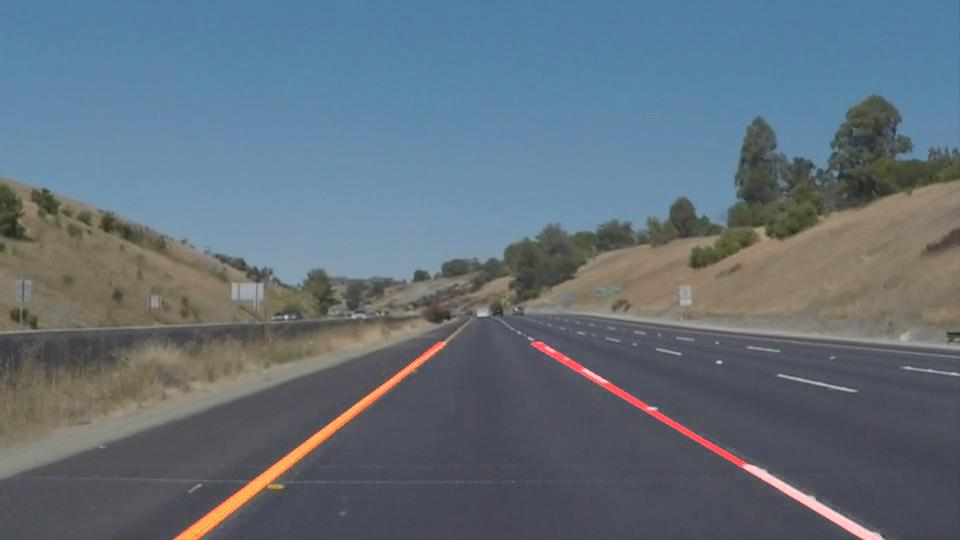

# **Finding Lane Lines on the Road** 

## Jens Hampe 04/2020

### This is a short description of term 1 for the UDACITY Self Driving Car Nanaodregree programm.

---

**Finding Lane Lines on the Road**

The goals / steps of this project are the following:
* Make a pipeline that finds lane lines on the road.

[//]: # (Image References)

---

### Reflection

### 1. Pipeline description. As part of the description, explain how you modified the draw_lines() function.

My pipeline consisted of 1 preperation step and 6 main steps.
In the prepration step 0 I only ensured that the directories for output files exist.

1. Color selection
2. Convertation to grayscale
3. Gussian smoothing/blurring and canny edge dedection
4. Masking with region of interest
5. Hough transformation
6. Generate a weighted image result   

#### Color selection
The first step covered the colour selection, therefore I implemented a new helper class '*color_select*' to select the white and yellow lines and mask it in yellow to get a sharp relief to the rest. The resulst of the color selection can be in the next images.

     

#### Convertation to grayscale
After that, I converted the images to grayscale as a preperatiopn step for the edge dedection.

     

####Gussian smoothing/blurring and canny edge dedection
Then I applied gaussian smoothing followed by the canny egde dedection process. The algorithm will first detect strong edge (strong gradient) pixels above a high threshold, and reject pixels below a low threshold. Next, pixels with values between the low_threshold and high_threshold will be included as long as they are connected to strong edges. The output edges is a binary image with white pixels tracing out the detected edges and black everywhere else.

      

#### Masking with region of interests
For the line dedection we are only interestet in lower area of the picture depending on the camara view.
So I defined a polygon for the region of interest depending of the size of the image and mask the images with this region. I also added a margin in the lower bound to exclude potential parts of the car like in the video 3.  

       

####Hough transformation
After masking the region of interests I used the Hough Transform to find lines from Canny Edges.
The Hough Transform  is a technique to find imperfect instances of objects within a certain class of shapes by a voting procedure. This voting procedure is carried out in a parameter space, from which object candidates are obtained as local maxima in a so-called accumulator space that is explicitly constructed by the algorithm for computing the Hough transform.

In order to draw a single line on the left and right lanes, I modified the draw_lines() function by separating line segments by their slope (dy/dx) to decide which segments are part of the left line vs. the right line.  Then, I average the position of each of the lines and extrapolate to the top and bottom of the lane.

    def draw_lines_new(img, lines, color=[255, 0, 0], thickness=2):
        """
        NOTE: this is the function you might want to use as a starting point once you want to 
        average/extrapolate the line segments you detect to map out the full
        extent of the lane (going from the result shown in raw-lines-example.mp4
        to that shown in P1_example.mp4).  

        Think about things like separating line segments by their 
        slope ((y2-y1)/(x2-x1)) to decide which segments are part of the left
        line vs. the right line.  Then, you can average the position of each of 
        the lines and extrapolate to the top and bottom of the lane.

        This function draws `lines` with `color` and `thickness`.    
        Lines are drawn on the image inplace (mutates the image).
        If you want to make the lines semi-transparent, think about combining
        this function with the weighted_img() function below
        """

        #right/left center list
        #right/left slope list
        rm = []
        lm = []
        rc = []
        lc = []

        #Iterate through each line point (x1,y1,x2,y2)
        for line in lines:
            for x1,y1,x2,y2 in line:
                # Calculate slopes and centers
                slope = ((y2-y1)/(x2-x1))
                center = [(x2+x1)/2,(y2+y1)/2]
                # Separate right and left by measuring slope, throw out steep 
                # vertical slopes

                # If the slope is between 0 and some small positiv number then
                # put the slope and center values in the right list
                if slope > 0.5 and slope < 2:
                    rm.append(slope)
                    rc.append(center)
                # If the slope is between 0 and some small negativ number then
                # put the slope and center values in the left list
                if slope < -0.5 and slope > -2:
                    lm.append(slope)
                    lc.append(center)

                # Average over all right/left center, slope values to get a singel
                # slope and center
                r_slope = np.sum(rm)/len(rm)
                l_slope = np.sum(lm)/len(lm)

                r_center = np.divide(np.sum(rc,axis=0),len(rc))
                l_center = np.divide(np.sum(lc,axis=0),len(lc))

                # Specify line height maybe could just be the half way of the
                # image height.
                # Find new (x1,y1,x2,y2) from using center and slope values 
                # fitting to the bottom of image and the specified height.

                # Setting the lower and upper borders dependig on the shape
                y1=img.shape[1]                 #lower border
                y2=int(round(img.shape[1]/2.8)) #upper border

                #(y-y')= M(x-x') we know (x,y) its center and we know M the slope
                # we can finde the x1, x2 values by calculating x' from plugging y'
                # as specified height or image bottom.
                if r_slope and r_center !=[]:
                    x1 = int(((r_center[1]-y1)/r_slope)-r_center[0])*-1
                    x2 = int(((r_center[1]-y2)/r_slope)-r_center[0])*-1
                    cv2.line(img, (x1, y1), (x2, y2), color, thickness)

                if l_slope and l_center !=[]:
                    x1 = int(((l_center[1]-y1)/l_slope)-l_center[0])*-1
                    x2 = int(((l_center[1]-y2)/l_slope)-l_center[0])*-1
                    cv2.line(img, (x1, y1), (x2, y2), color, thickness) 

     

####Generate a weighted image result
In the last step I createted the weighted results with the founded lanes colored in red on the starting image.
 
     

### 2. Identify potential shortcomings with your current pipeline

One potential shortcoming would happen when processing more dynamic sceneries with shadows and patchy streets. The present processing pipelins didn't cover this issue.  

Another shortcoming could be strong sunlight direct to the lens of the camara or foggy environments which disturbe the image processing.   

### 3. Suggest possible improvements to your pipeline

A possible improvement would be to analyse the hue, satration and brightness of the image to set the right thresholds and parameter for each step of the processing pipeline depending on the analyzed image.   

Another potential improvement could be to use more than one camara and to do a kind of sensorfusion with more than one camara and also in combination with other senseors.

The region masking could be done at first, that could improve the efficiency of the further image processing
